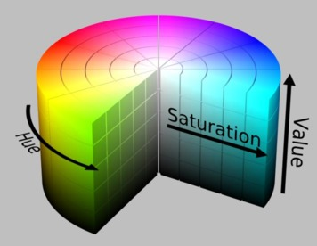
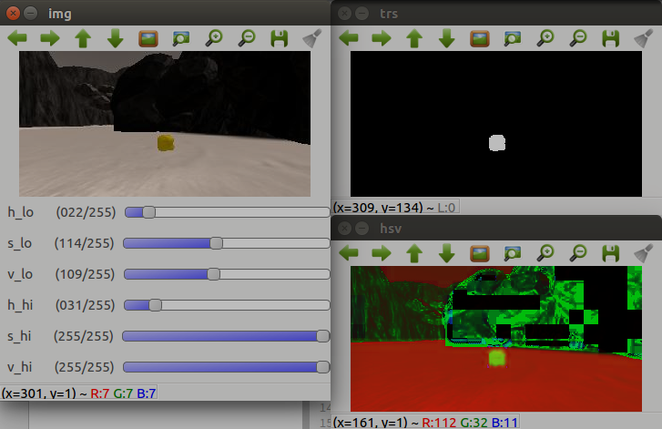
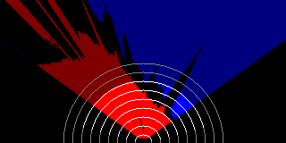
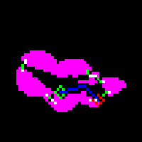

# Project : Search and Sample Return

Yoonyoung Cho | 03/16/2018

# Notebook Analysis

## Color Selection

Unlike the examples provided, I first converted the input image in the HSV colorspace in order to minimize sensitivity to brightness, or saturation ([image source](https://www.researchgate.net/figure/HSV-Color-Space_fig2_284488273)).

The three types of environmental markers (ground plane, obstacles and rocks) were clearly distinguishable in the RGB colorspace as well, so it was mostly a matter of personal preference. I wanted to take extra precaution in order to avoid confusion between by the presence of shadows and lit points on the ground (even though the difference was perhaps negligible), which may have influenced the perception of the rover throughout the mission at unexpected points.

Thenceforth, in order to identify the thresholds, I created a [separate script](./code/helpers/find_color.py) that took in an image and basically allowed the user to find lower and upper bounds by clicking on multiple sample points (for reference), and adjusting trackbars to apply the bounds on the hsv image to produce the thresholded image. I use this functionality often enough, that I wanted to write something nice once, that I could use multiple times in the future. Here's what a typical interaction would look like:

## Image Processing Pipeline

The perspective transform was simply adopted from the [notebook](./code/Rover_Project_Test_Notebook.ipynb); after some experimentation, it appeared that the numbers provided by the lecture seemed to yield a more accurate projection, so I reused the values in all subsequent experiments.

Here's the [video](https://youtu.be/TxpBHgyOvME) that demonstrates the full pipeline; it shows the mosaic built by moviepy in the notebook.

# Autonomous Navigation and Mapping

The Demo Video is available [here](https://youtu.be/v4ewCJhmwAo). It's fairly long, so I recommend speeding up the playback rate.

For the most pleasant viewing experience, I recommend downloading the video and playing it with [VLC](https://www.videolan.org/vlc/index.html) at at least 4x playback, as Youtube does not support acceleration greater than 2x.

## Perception

Given the fairly simple visual scene, the perception pipeline did not require significant modifications beyond the basic image-processing and coordinate transformations that had been introduced through the materials in the tutorial.

Most of the improvements on perception was centered around *filtering* the input data, such that the noisy estimation of navigable terrain could at least provide a reasonable accuracy, at no observable cost in the rate of update. At the final stage, each datapoint was filtered by its range from the robot and angular displacement; in addition, updates to the map was limited to when the robot was relatively flat on the ground, where fair perspective transform was guaranteed.

In the below image, the lit region indicates points that are considered valid; the spacing is in 1 meter intervals. Red actually indicates the navigable region (due to BGR ordering in OpenCV), while regions in blue are the obstacles.

The filtering code and its visualization can be found [here](./code/img_proc.py).

In the final version, I decided to filter the outputs for when the rover was within +-1 degrees in terms of roll and pitch, as well as the points that were within 7 meters from the rover at less that 75 degrees offset from its yaw. It turned out filtering for angular displacement wasn't mission critical (in fact, the filtered range was greater than the camera's field of view!), but I kept it in there anyways in case it became necessary.

## Decision

### State Machine
The decision portion of the algorithm probably underwent the greatest amount of transformation. In particular, the behavior dictated by the default decision tree was inherently full reactive control, where no high-level planning was involved. This constrained the robot's exploration such that it was unable to survey the whole map.

In order to mitigate this, I decided to implement a [Finite State Machine](https://en.wikipedia.org/wiki/Finite-state_machine) in control of the robot's behavior, which can be found in [rover\_fsm.py](./code/rover_fsm.py). Based on the current map, it will produce and rank a list of frontiers for exploration, use A\* path-finding algorithm to find the route, and travel through local waypoints while trying to avoid obstacles. For extra challenge, I also decided to make the robot pick the samples up, which proved to be no easy task.

Whereas the overall structure of the FSM isn't particularly innovative, I did take the liberty to construct a hierarchical FSM composed of several layers of states. In practice, each state was invoked from several places and overall ended up being a bit of a cobweb, but in principle the logic flows according to the following diagram:

The rover starts by planning its route while going through good candidates for frontiers. In order to prevent the rover from being stuck without a goal, the rover defaults to swerving (reactive obstacle avoidance) while in planning mode. While this may not be ideal in real-world scenarios (because of heavy processing and possible artifacts in the map while moving around, it can be beneficial to "stop and think" while trying to perform high-level planning tasks), it works fairly well under the simulated conditions.

When a good frontier is found, the FSM will issue the path-planner a goal, and find a good global trajectory. After post-processing the trajectory, the waypoints are then sent to the local planner, which then travels along the waypoints one-by-one. If, during its travel, the rock sample is seen, the current exploration will be aborted in favor of collecting the sample; after the sample is picked up, or the destination frontier is reached, the rover will continue the exploration by returning to the planning state.

At any point during navigation, if the rover is stuck, the rover will perform a series of unstuck maneuvers that go through turning counterclockwise, going backwards, turning clockwise, and going forwards. This is not exactly elegant, but works somewhat well in practice.

Note that there is no "terminal" state in the FSM; this is because there is no real need for the rover to stop, under the given constraints. In the current process, the rover will continue to roam the map forever in search of the rock samples.

### Exploration

Reactive control has its limitations in how the robot explores around the environment; in particular, even if there are multiple pathways that had not been previously visited, the rover will behave deterministically and always select the path that it had gone before. This means that without definition of *where* the most desirable target locations are -- i.e. a high-level planner and the definition of a good frontier, the robot will not be able to fully explore the environment.

Rigorously defining the frontier proved to be a challenging task. In a high-level description, a *frontier* for the robot is any region in the map that had not been previously explored; in my case, that meant the *boundary* between identified obstacle and navigable terrain. Among the attempts, I had tried to directly find the contour between the two masks, which proved to be not the most effective strategy. I am not currently aware of a function that will automatically produce the desirable polyline boundary between two color-defined regions without creating artifacts.

I ultimately settled as finding the dilated contour around the navigable region that were *not* covered by the obstacle layers. The frontiers were then sorted by how close it is to the rover, as well as how well it aligns with its current orientation. This was mostly to prevent the rover from oscillating back and forth between distant frontiers, which had been a major time-sink for some iterations.

In the figure, marked in green are the current frontiers; green circle is the current position, red circle is the goal, and the blue path is the global path. Obstacles are marked in magenta.

Overall, this proved to be a good enough approximation of the gaps between walls, that it allowed the rover to complete the map at nearly 98% completion with high fidelity.

## Discussion

### Results

As seen in the video, the rover was successfully able to map and explore **96.5%** of the world, with **83%** fidelity, while collecting **5 rock samples**. The whole mission took about **21 minutes and 20 seconds**.

### Issues

As the rover autonomously navigated and explored the environment, I identified several issues that were not *critical* to the execution, but nonetheless ended up taking up a significant portion of time:

- Local Planner

    In the current implementation, the local planner isn't quite as intelligent as it should be; it simply interpolates between swerving behavior (for obstacle avoidance) and waypoint following behavior (for getting to the final destination). This means that, in principle, there may be edge-cases in which the rover cannot avoid obstacles, or cannot follow the waypoints, when the two behaviors are in severe conflicts. Sometimes it is seen to oscillate in turning, a possible result of such a conflict. It would be nice to have a local planner that can prioritize obstacle avoidance in the presence of immediate danger, and otherwise schedule waypoints intelligently.
    
- Global Planner

    I'm currently using my own implementation of [A\*](code/astar.py) for global path-planning, with a relatively simple heuristic function that penalizes for being too close to obstacles, and a simple euler distance from the goal. The paths are then simplified by [cv2.approxPolyDP()](https://docs.opencv.org/2.4/modules/imgproc/doc/structural_analysis_and_shape_descriptors.html#approxpolydp) into an approximate trajectory with fewer waypoints. Whereas this approach is *functional*, ideally the paths produced would be smooth (to prevent stopping to perform in-place turns, which consumes time) and obstacle-free (as sometimes the naive simplification tries to cut across obstacles).
    
- Boulders

    Escaping the boulders in the map proved to be quite a challenge; the success rate of the *unstuck* operations were (empirically) about 90%, although taking tens of seconds at times. Part of the problem was that the camera, when too close to the boulder, would not render them -- which, for the planner, meant that it had a relatively clear path ahead of them. If the planner could always avoid obstacles before even encountering them, this issue would not have surfaced; but since the planner had some trouble trying to resolve obstacle avoidance and navigating to the target location, it would seldom run into rocks and spend some time trying the heuristics to get unstuck.
    
- Semi-Navigable Terrain

    At the intersection between flat ground regions and the obstacles, there exist semi-navigable terrain in which the rover *could* momentarily get stuck, to slow down the mission. Currently, in the processing pipeline, they are treated as "neither obstacle nor navigable" but in reality they are quite a challenge to traverse. To treat this entirely as an obstacle, however, would make planning narrow passageways more difficult. Some heuristic has been implemented to account for buffer zones, but the rover still gets stuck in these boundaries quite often.

### Other Improvements

In the current implementation, the local planner of the rover actually examines the *global* map, which can be problematic in real-world scenarios due to possible latency issues, localization errors, etc. While the local planner has range limits of approximately 6m, and a critical flaw that the projection cannot be trusted when the rover is not nearly flat to the ground plane, it would be nice to be able to integrate local maps to the local planner.

In addition, at the moment the planner does not *revisit* idenfieid rock samples if the collection procedure failed; while the odds of this event is not high, it would be ideal if the global planner could be repurposed for two different objectives: exploration of the area (going to frontiers) and collection of rock samples (going to locations). While this would not be a huge modification to the current implementation, the task was not of high-priority, as the rate of failure in collection was fairly low.

## Appendix

As requested, here are the simulation parameter to reproduce the results:

- Resolution : 1024x768, Windowed
- Graphics Quality : Good
